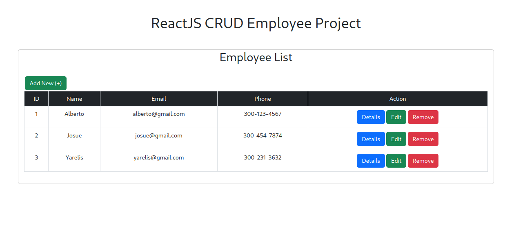
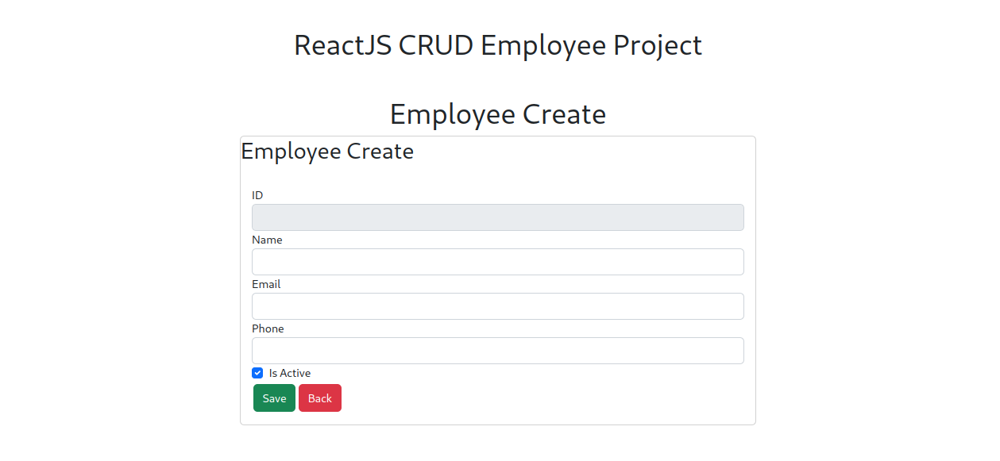
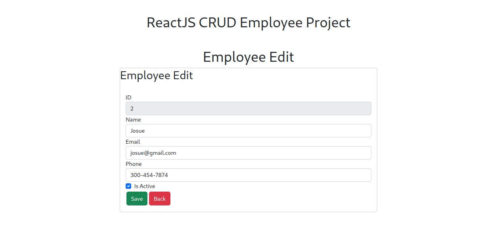

# ReactJS CRUD Employee Project

### Listing



### Create



### Edit



## How to run this project locally

**You need NodeJS installed to run this**

1. Clone the repo locally: `git clone REPO URL`
2. `npm install`
3. Terminal 1: `npm start`
4. Terminal 2: `Run JSON Server`

### Run JSON Server

`npm i json-server`  
`json-server --watch db.json --port 8000`

### Useful commands shortcuts

```
usf: useState -> const [, set] = useState();

uef: useEffect -> useEffect(() => {}, []);

imrs import React, { useState } from 'react';

imrse import React, { useState, useEffect } from 'react';
```

```
// sfc
const  = () => {
  return (  );
}

export default ;

// rafce
import React from 'react'

const EmpCreate = () => {
  return (
    <div>EmpCreate</div>
  )
}

export default EmpCreate
```
